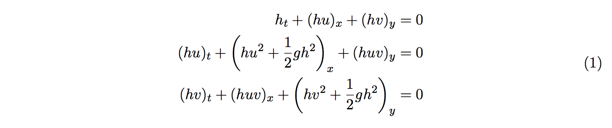
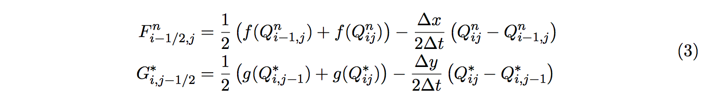

# OpenMP Advanced project

## About this exercise

The aim of this exercise is to give hands-on experience in parallelizing a
larger program, measure parallel performance and gain experience in what to
expect from modern multi-core architectures.

In the exercise you will use a dual hexadeca-core shared memory Intel Xeon
E5-2698v3 Haswell node. There will be several nodes available on the Cray for
interactive use during the lab and each group will have access to a node of
their own. Running the program should therefore give you realistic timings and
speedup characteristics.

Your task is to parallelize a finite-volume solver for the two dimensional
shallow water equations. Measure speedup and if you have time, tune the code.
You don’t need to understand the numerics in order to solve this exercise (a
short description is given in Appendix A). However, it assumes some prior
experience with OpenMP, please refer to the lecture on shared memory
programming if necessary.

## Algorithm

For this exercise we solve the shallow water equations on a square domain using
a simple dimensional splitting approach. Updating volumes Q with numerical
fluxes F and G, first in the x and then in the y direction, more easily
expressed with the following pseudo-code

```
for each time step do
    Apply boundary conditions
    for each Q do
        Calculate fluxes F in the x-direction
        Update volume Q with fluxes F
    end
    for each Q do
        Calculate fluxes G in the y-direction
        Update volumes Q with fluxes G
    end
end
```

In order to obtain good parallel speedup with OpenMP, each sub-task assigned to
a thread needs to be rather large. Since the nested loops contains a lot of
numerical calculations the solver is a perfect candidate for OpenMP
parallelization. But as you will see in this exercise, it’s fairly difficult to
obtain optimal speedup on today’s multi-core computers. However, it
should be fairly easy to obtain some speedup without too much effort. The
difficult task is to make a good use of all the available cores.

Choose to work with either the given serial C/Fortran 90 code or, if you think
you have time, write your own implementation (but don’t waste time and energy).
Compile the code by typing make and execute the program ``shwater2d`` with ``srun`` as
described in the [general
instructions](https://www.pdc.kth.se/support/documents/courses/summerschool.html).

### 1. Parallelize the code. 

Start with the file [shwater2d.c](c/shwater2d.c) or 
[shwater2d.f](f90/shwater2d.f90), add OpenMP statements to make it run in
parallel and make sure the computed solution is correct. Some advice are given
below

- How should the work be distributed among threads 
- Don’t parallelize everything
- What’s the difference between

```
!$omp parallel do
    do i=1,n
    ...
!$omp end parallel do
!$omp parallel do
    do j=1,m
    ...
!$omp end parallel do
```

and

```
!$omp parallel
    !$omp do
        do i=1,n
        ...
    !$omp end do
    !$omp do
        do j=1,m
        ...
    !$omp end do
!$omp end parallel
```

_Hint: How are threads created/destroyed by OpenMP? How can it impact performance?_

### 2. Measure parallel performance.

In this exercise, parallel performance refers to the computational speedup _S<sub>n</sub>_ =
_T_<sub>1</sub>/_T<sub>n</sub>_, using _n_ threads. Measure run time T for 1, 2, ..., 16 threads and
calculate speedup. Is it linear? If not, why? Finally, is the obtained speedup
acceptable? Also, try to increase the space discretization (M,N) and see if it
affects the speedup.

Recall from the OpenMP exercises that the number of threads is determined by an
environment variable ``OMP_NUM_THREADS``. One could change the variable or use
the shell script provided in Appendix B.

### 3. Optimize the code.

The given serial code is not optimal, why? If you have time, go ahead and try
to make it faster. Try to decrease the serial run time. Once the serial
performance is optimal, redo the speedup measurements and comment on the
result.

For debugging purposes you might want to visualize the computed solution.
Uncomment the line ``save_vtk``. The result will be stored in ``result.vtk``, which can
be opened in ParaView, available on the lab computers (and also on Tegner) after 
``module add paraview``. Beware that the resulting file could be rather large,
unless the space discretization (M,N) is decreased.

### A. About the Finite-Volume solver

In this exercise we solve the shallow water equations in two dimensions given
by 



where _h_ is the depth and (_u_,_v_) are the velocity vectors. To solve the equations
we use a dimensional splitting approach, i.e. reducing the two dimensional problem
to a sequence of one-dimensional problems


For this exercise we use the Lax-Friedrich’s scheme, with numerical fluxes _F_, _G_
defined as



where _f_ and _g_ are the flux functions, derived from (1). For simplicity we use
reflective boundary conditions, thus at the boundary


### B. Run script for changing OMP_NUM_THREADS

```
#!/bin/csh
foreach n (`seq 1 1 16`)
    env OMP_NUM_THREADS=$n srun -n 1 ./a.out
end
```
