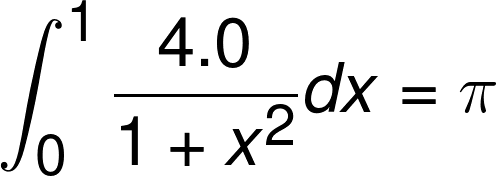
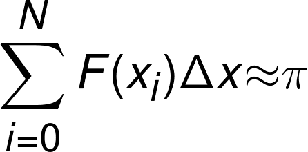

# OpenMP Lab Assignment

## Overview

The goal of these exercises is to familiarize you with OpenMP environment and
make our first parallel codes with OpenMP. We will also record the code
performance and understand race condition and false sharing. This laboratory
contains four exercises, each with step-by-step instructions below.

For your experiments, you are going to use a node of the
[Beskow](https://www.pdc.kth.se/hpc-services/computing-systems/beskow-1.737436)
supercomputer.  To run your code on Beskow, you need first to generate your
executable. It is very important that you include a compiler flag telling the
compiler that you are going to use OpenMP. If you forget the flag, the compiler
will happily ignore all the OpenMP directives and create an executable that
runs in serial. Different compilers have different flags. When using Cray
compilers, the OpenMP flag is ``-openmp``.

To compile your C OpenMP code using the default Cray compilers:

```
cc -O2 -openmp -lm name_source.c -o name_exec
```

Alternatively, compile your C OpenMP code using GNU compilers:

```
module swap PrgEnv-cray PrgEnv-gnu
cc -O2 -fopenmp -lm name_source.c -o name_exec
```

In Fortran, it is recommended to use the Intel compiler

```
module swap PrgEnv-cray PrgEnv-intel
ftn -fpp -O2 -openmp -lm name_source.f90 -o name_exec
```

To run your code on Beskow, you will need to have an interactive allocation:

```
salloc -N 1 -t 4:00:00 -A edu18.summer --reservation=summer-2018-08-15
```

To set the number of threads, you need to set the OpenMP environment variable:

```
export OMP_NUM_THREADS=<number-of-threads>
```

To run an OpenMP code on a computing node of Beskow:

```
aprun -n 1 -d <number-of-threads> -cc none ./name_exec
```

## Exercise 1 - OpenMP Hello World: get familiar with OpenMp Environment

_Concepts: Parallel regions, parallel, thread ID_

Here we are going to implement the first OpenMP program. Expected knowledge
includes basic understanding of OpenMP environment, how to compile an OpenMP
program, how to set the number of OpenMP threads and retrieve the thread ID
number at runtime.

Your code using 4 threads should behave similarly to:

Input:

```
aprun -n 1 -d 4 -cc none ./hello
```

Output:

```
Hello World from Thread 3
Hello World from Thread 0
Hello World from Thread 2
Hello World from Thread 1
```

Instructions: Write a C/Fortran code to make each OpenMP thread print "``Hello
World from Thread X!``" with ``X`` = thread ID.

Hints:

- Remember to include OpenMP library
- Retrieve the ID of the thread with ``omp_get_thread_num()`` in C or in Fortran ``OMP_GET_THREAD_NUM()``.

Questions:

- How do you change the number of threads?
- How many different ways are there to change the number of threads? Which one are those?
- How can you make the output ordered from thread 0 to thread 4?

## Exercise 2 - Creating Threads: calculate &pi; in parallel using pragma omp parallel

_Concepts: Parallel, default data environment, runtime library calls_

Here we are going to implement a first parallel version of the pi.c / pi.f90
code to calculate the value of &pi; using the parallel construct.

The figure below shows the numerical technique, we are going to use to calculate &pi;.


Mathematically, we know that



We can approximate the integral as a sum of rectangles



where each rectangle has width &Delta;x and height F(x<sub>i</sub>) at the middle of interval i.

A simple serial C code to calculate &pi; is the following:

```
    unsigned long nsteps = 1<<27; /* around 10^8 steps */
    double dx = 1.0 / nsteps;

    double pi = 0.0;
    double start_time = omp_get_wtime();

    unsigned long i;
    for (i = 0; i < nsteps; i++)
    {
        double x = (i + 0.5) * dx;
        pi += 1.0 / (1.0 + x * x);
    }
    pi *= 4.0 * dx;
```

Instructions: Create a parallel version of the pi.c / pi.f90 program using a
parallel construct: ``#pragma omp parallel``. Run the parallel code and take the
execution time with 1, 2, 4, 8, 16, 32 threads. Record the timing.

Pay close attention to shared versus private variables.

- In addition to a parallel construct, you might need the runtime library routines
- ``int omp_get_num_threads()``; to get the number of threads in a team
- ``int omp_get_thread_num()``; to get thread ID
- ``double omp_get_wtime()``; to get the time in seconds since a fixed point in the past
- ``omp_set_num_threads()``; to request a number of threads in a team

Hints:

- Use a parallel construct: ``#pragma omp parallel``.
- Divide loop iterations between threads (use the thread ID and the number of threads).
- Create an accumulator for each thread to hold partial sums that you can later
  combine to generate the global sum.

Questions:

- How does the execution time change varying the number of threads? Is what you
  expected? If not, why you think it is so?
- Is there any technique you heard in class to improve the scalability of the
  technique? How would you implement it?

## Exercise 3 - Calculate &pi; using critical and atomic directives

_Concepts: parallel region, synchronization, critical, atomic_

Here we are going to implement a second and a third parallel version of the
pi.c / pi.f90 code to calculate the value of &pi; using the critical and atomic
directives.

Instructions: Create two new parallel versions of the pi.c / pi.f90 program
using the parallel construct ``#pragma omp parallel`` and 1) ``#pragma omp critical``
2) ``#pragma omp atomic``. Run the two new parallel codes and take the execution
time with 1, 2, 4, 8, 16, 32 threads. Record the timing in a table.

Hints:

- We can use a shared variable &pi; to be updated concurrently by different
  threads. However, this variable needs to be protected with a critical section
  or an atomic access.
- Use critical and atomic before the update ``pi += step``

Questions:

- What would happen if you hadn’t used critical or atomic a shared variable?
- How does the execution time change varying the number of threads? Is it what
  you expected?
- Do the two versions of the code differ in performance? If so, what do you
  think is the reason?

## Exercise 4 - Calculate &pi; with a loop and a reduction

_Concepts: worksharing, parallel loop, schedule, reduction_

Here we are going to implement a fourth parallel version of the pi.c / pi.f90
code to calculate the value of &pi; using ``omp for`` and ``reduction`` operations.

Instructions: Create a new parallel versions of the pi.c / pi.f90 program using
the parallel construct ``#pragma omp for`` and ``reduction`` operation. Run the new
parallel code and take the execution time for 1, 2, 4, 8, 16, 32 threads. Record
the timing in a table. Change the schedule to dynamic and guided and measure
the execution time for 1, 2, 4, 8, 16, 32 threads.

Hints:

- To change the schedule, you can either change the environment variable with
``export OMP_SCHEDULE=type`` where ``type`` can be any of static, dynamic, guided or in
the source code as ``omp parallel for schedule(type)``.

Questions:

- What is the scheduling that provides the best performance? What is the reason for that?
- What is the fastest parallel implementation of pi.c / pi.f90 program? What is
  the reason for it being the fastest? What would be an even faster implementation
  of pi.c / pi.f90 program?
